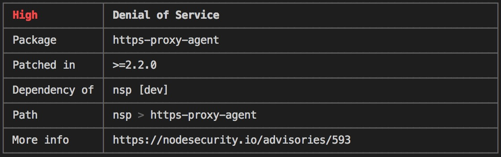

## Node Security Platform

Node Security Platform(nsp)是一个Node平台下检查依赖包安全漏洞的工具，安装和使用方法都非常简单：

```
npm i -g nsp
nsp check
```


上图是`nsp check`当前项目输出的报告，依赖含有3个安全缺陷，下面的表格是针对缺陷的简要描述，包含缺陷包的路径和当前版本，和补丁包版本。除了这种默认输出，`--reporter`参数还包含了各种姿势的报告输出方式，具体可参见官文档：[https://github.com/nodesecurity/nsp](https://github.com/nodesecurity/nsp)

## npm audit

不过从npm@6开始，不需要再通过nsp来检查依赖安全了，18年4月已被npm官方收购，并在npm@6版本里加入了`audit`命令。它将会检查`dependencies`, `devDependencies`, `bundledDependencies`, `optionalDependencies`等依赖（不包含`peerDependencies`），并且会在通过`npm install`安装的时候自动检查。当然，也可以通过`--no-audit`参数来关闭安装依赖包时的检查，或者直接设置为全局关闭：

```
npm install example-package-name --no-audit
npm set audit false
```

`npm audit`输出的报告包含一系列表格，每个表格都简要说明了当前项目里有缺陷的依赖包的信息，主要有以下几个方面：



+ Severity: 缺陷的严重程度，主要包含Critical-立即处理，High-尽快处理，Moderate-有空处理，Low-爱处理不处理  
+ Description: 缺陷描述，比如`Denial of Service`
+ Package: 包含缺陷的依赖包名
+ Patched in: 解决该缺陷的版本范围，如`>=0.5.1`
+ Dependency of: 依赖于该缺陷的模块
+ Path: 依赖路径
+ More Info: 查看对应的安全报告链接

## npm audit fix

当报告出来后，需要对报告的缺陷进行修复。

```
found 37 vulnerabilities (18 low, 14 moderate, 5 high) in 2982 scanned packages
  run `npm audit fix` to fix 18 of them.
  14 vulnerabilities require semver-major dependency updates.
  5 vulnerabilities require manual review. See the full report for details.
```

如上，报告发现了37个缺陷，18个低优先级，14个中等，5个高优先级，可以通过一下方式进行修复：

+ 运行`npm audit fix`将会自动修复兼容的依赖更新。
+ 一些依赖包补丁可能在semver上不兼容，需要通过推荐命令手动安装，并且在semver主版本发生变化的情况下，可能需要查看api的兼容性，人肉修改项目代码。当然，也可以使用`npm audit fix --force`强制自动修复更新。
+ 如果没有补丁包，可能就需要自己根据`More info`去修复补丁了。

## More

+ snyk是一款商业漏洞扫描工具，相对npm audit好像更牛逼。
+ 目前大部分的严重漏洞集中在`Denial of service`，可深入研究一下漏洞原理。
